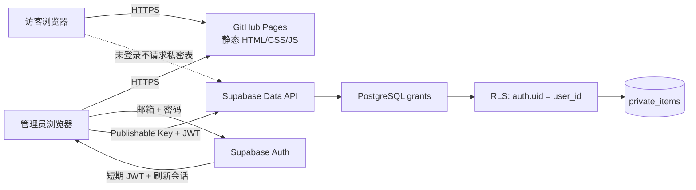

# 我的工作台 / 个人数字花园

一个可以直接部署到 GitHub Pages 的响应式个人工作台：公开区域聚合常用入口与 Now 信息；登录后可管理任务、学习记录和私人笔记。静态文件由 GitHub Pages 托管，账号、会话和数据由 Supabase Auth + PostgreSQL RLS 负责，因此不需要自己维护服务器。

> 安全边界：Supabase 的 Publishable Key 本来就会出现在浏览器代码中，它不是秘密。真正的数据权限由数据库的 grants + RLS 决定。`sb_secret_...`、旧版 `service_role`、数据库密码绝不能放进前端、GitHub Actions 变量或仓库。

## 1. 整体架构



数据流分成两条：

1. **公开内容**：个人简介、常用链接、Now、关于说明都在构建时写进静态文件，任何访客都能看。
2. **私密内容**：浏览器用 Supabase Auth 登录，得到用户 JWT；之后每次查询都同时经过 PostgreSQL 表权限和 RLS。SQL 中没有任何 `anon` 策略，且撤销了 `anon` 的所有表权限。

即使访客绕过页面、自己调用 Supabase REST API，也会先被表权限拒绝。即使将来误创建了第二个账号，该账号也只能操作 `user_id = auth.uid()` 的行，无法读写你的行。

## 2. 为什么本项目没有直接使用 Hugo

Hugo 很适合“文章为主”的站点，但这里的核心工作流是登录后的交互式 CRUD。最终采用 **React + Vinext 静态导出 + Supabase**：构建结果仍是纯静态文件，能免费部署到 GitHub Pages，同时登录、表单、筛选和会话状态更容易维护。

| 方案 | 优点 | 不足 | 适合情况 |
| --- | --- | --- | --- |
| Hugo + JavaScript | 构建快；Markdown 内容体验好；主题多 | 私密面板仍要单独写一套 JS；同时学习 Go Template 和前端状态 | 文章数量很多、交互很少 |
| 本项目：React 静态导出 | 单一组件模型；TypeScript；CRUD 和响应式体验清晰；Pages 可托管 | 依赖与构建工具比 Hugo 多 | 个人工作台、仪表盘、私密数据 |
| 纯 HTML/CSS/JS | 最少依赖，原理直观 | 页面和状态增长后容易变乱；类型与组件复用弱 | 极小的单页导航 |
| 完整 Next.js 服务端部署 | SSR、服务端路由和 Cookie 能力强 | GitHub Pages 没有服务端运行时；要换 Vercel/Cloudflare 等 | 需要服务端逻辑、多用户产品 |

如果以后文章系统成为主角，可以再增加 Markdown/MDX 内容层；无需更改 Supabase 的私密数据安全模型。

## 3. 需要注册的账号

### GitHub

1. 打开 [GitHub](https://github.com/) 注册账号并验证邮箱。
2. 新建一个公开仓库，例如 `personal-workbench`。免费版 GitHub Pages 用公开仓库最省事。
3. 暂时不要添加 README、`.gitignore` 或 License；本目录已经包含这些内容。
4. 仓库创建后记住页面上的远程地址，例如 `https://github.com/你的用户名/personal-workbench.git`。

### Supabase

1. 打开 [Supabase](https://supabase.com/) 注册或用 GitHub 登录。
2. 创建 Organization，再点 **New project**。
3. 设置项目名、强数据库密码和离你较近的区域。数据库密码只用于管理，网站前端不会使用它。
4. 项目就绪后，在顶部 **Connect**，或 **Settings → API Keys** 中复制：
   - Project URL，例如 `https://abc123.supabase.co`
   - Publishable key，例如 `sb_publishable_...`
5. 打开 **Authentication → Users → Add user / Create new user**，创建唯一管理员邮箱和强密码，并确认邮箱。界面文案如果略有差异，以“创建一个已确认的永久用户”为目标。
6. 打开 **Authentication → Sign In / Providers**（有些界面在 General Configuration）：
   - 保持 Email + Password 登录开启；
   - 关闭 **Allow new users to sign up**；
   - 关闭 **Allow anonymous sign-ins**。
7. 在 **Authentication → URL Configuration** 中把 Site URL 设为最终 GitHub Pages 地址，例如 `https://你的用户名.github.io/personal-workbench/`。当前密码登录不依赖跳转，但这样以后增加重置密码不会踩坑。

## 4. 项目目录

```text
.
├─ app/
│  ├─ globals.css              # 主题、响应式布局和组件外观
│  ├─ layout.tsx               # 标题、OG/Twitter 分享元数据
│  └─ page.tsx                 # 首页入口
├─ components/
│  ├─ workbench.tsx            # 搜索、登录、私密 CRUD 主逻辑
│  └─ ui/                      # 可访问性良好的界面基础组件
├─ lib/
│  ├─ database.types.ts        # private_items 的 TypeScript 类型
│  └─ supabase.ts              # 浏览器 Supabase 单例
├─ public/
│  ├─ og.png                   # 1200×630 社交分享图
│  └─ .nojekyll                # 避免 Pages 忽略 _next 目录
├─ supabase/
│  ├─ schema.sql               # 表、grants、四条 RLS 策略
│  └─ verify_rls.sql           # 安全配置的只读检查
├─ .github/workflows/
│  └─ deploy-pages.yml         # GitHub Pages 自动部署
├─ .env.example                # 仅含浏览器可公开配置的模板
└─ next.config.ts              # 静态导出和 Pages 子路径适配
```

## 5. 分步骤搭建与测试

### 步骤 A：先运行静态站骨架

需要 Node.js 22.13+ 和 pnpm 11。

```powershell
pnpm install --frozen-lockfile
pnpm dev
```

浏览器打开 `http://localhost:3000`。此时即使没有 Supabase：

- 公开首页、搜索、外链和响应式布局应正常；
- 私密空间显示“等待连接”；
- 页面不应因为缺少环境变量而崩溃。

手机测试可用浏览器开发者工具切到 390px 宽；链接卡片应变成单列，私密工作台也不会横向溢出。

### 步骤 B：创建数据库与 RLS

1. 在 Supabase Dashboard 打开 **SQL Editor → New query**。
2. 完整复制并运行 [`supabase/schema.sql`](supabase/schema.sql)。
3. 再运行 [`supabase/verify_rls.sql`](supabase/verify_rls.sql)。

预期结果：

- `rls_enabled` 和 `rls_forced` 都是 `true`；
- `authenticated` 只有 SELECT/INSERT/UPDATE/DELETE；结果中没有 `anon`；
- 恰好四条策略，分别对应 SELECT、INSERT、UPDATE、DELETE；
- 每条策略都只对 `authenticated` 生效，并检查 `auth.uid() = user_id`。

为什么 UPDATE 同时有 `USING` 和 `WITH CHECK`：前者限制“能改哪一行”，后者限制“改完后这行仍属于谁”，防止把 `user_id` 改成别人。

### 步骤 C：连接 Supabase Auth

复制环境变量模板：

```powershell
Copy-Item .env.example .env.local
```

编辑 `.env.local`：

```dotenv
NEXT_PUBLIC_SUPABASE_URL=https://你的项目引用.supabase.co
NEXT_PUBLIC_SUPABASE_PUBLISHABLE_KEY=sb_publishable_你的值
NEXT_PUBLIC_SITE_URL=http://localhost:3000
```

重新启动 `pnpm dev`，点击“私密空间”，使用在 Supabase Dashboard 创建的管理员邮箱和密码登录。

验证点：

1. 错误密码只显示通用登录失败，不泄露账号是否存在。
2. 登录后能新建任务、学习记录或笔记。
3. 刷新页面后会话仍在，记录仍从数据库读取。
4. 可以编辑、筛选和删除记录。
5. 退出后列表立即清空，页面不再查询私密表。

### 步骤 D：验证匿名访问确实失败

最简单的检查是退出登录并直接调用 REST API。将下面两个值换成自己的 Project URL 和 Publishable Key：

```powershell
$projectUrl = 'https://你的项目引用.supabase.co'
$publishableKey = 'sb_publishable_你的值'
Invoke-WebRequest `
  -Uri "$projectUrl/rest/v1/private_items?select=*" `
  -Headers @{ apikey = $publishableKey }
```

预期是 HTTP 401/403 或 PostgreSQL `42501 permission denied`，并且响应里没有任何记录。因为 SQL 同时做了两件事：

- `revoke all ... from anon`：匿名角色没有表权限；
- 没有任何 `to anon` 的 RLS policy：即使未来误加了 grant，也仍没有公开读策略。

不要用 Dashboard 的 SQL Editor 直接执行 `select *` 来模拟访客；SQL Editor 使用高权限管理角色，会绕过普通 API 用户的权限路径。

### 步骤 E：本地生产构建

```powershell
pnpm build
```

静态产物位于 `dist/client/`。Windows 上若 Vinext 在完成全部预渲染后只打印 libuv 关闭断言，但 `dist/client/index.html` 已生成，这是上游 Windows/Node 退出阶段问题；GitHub Actions 的 Linux 构建不受此影响。仍应确认输出包含 `index.html`、`_next/`、`og.png` 和 `.nojekyll`。

## 6. 部署到 GitHub Pages

### 首次推送

```powershell
git init
git add .
git commit -m "Build personal workbench"
git branch -M main
git remote add origin https://github.com/你的用户名/personal-workbench.git
git push -u origin main
```

### 配置构建变量

在 GitHub 仓库打开 **Settings → Secrets and variables → Actions → Variables**，新增：

- `NEXT_PUBLIC_SUPABASE_URL`
- `NEXT_PUBLIC_SUPABASE_PUBLISHABLE_KEY`

它们都会被打包进浏览器代码，因此只能使用 Publishable Key。绝不要在这里填 `sb_secret_...`、`service_role` 或数据库密码。

### 开启 Pages

1. 打开 **Settings → Pages**。
2. Source 选择 **GitHub Actions**。
3. 打开 **Actions** 标签，等待 `Deploy personal workbench to GitHub Pages` 变绿。
4. 部署工作流会自动识别仓库名，为项目站点添加 `/personal-workbench` 基础路径；不需要手工改代码。

以后每次推送到 `main`，都会自动重新构建并部署 `dist/client`。

## 7. 个性化入口

公开链接和 Now 文案目前集中在 [`components/workbench.tsx`](components/workbench.tsx) 顶部：

- 修改 `linkGroups` 可替换分类、网址和说明；
- 修改 `typeMeta` 可调整私密记录类型显示；
- 搜索会自动覆盖所有入口名称与说明；
- 首页简介和 Now 文案也在同一文件中，便于新手先从一个地方修改。

## 8. 安全清单

- [ ] 前端只使用 `sb_publishable_...`，没有 secret/service-role key。
- [ ] Supabase 已关闭公开注册和匿名登录。
- [ ] `private_items` 同时启用 RLS 与 FORCE RLS。
- [ ] `anon` 没有任何表权限和策略。
- [ ] SELECT/INSERT/UPDATE/DELETE 四条 owner policy 都存在。
- [ ] GitHub 仓库中没有 `.env.local`。
- [ ] 不把密码、恢复码、API 密钥和身份证件放进普通笔记表。
- [ ] Supabase 管理员账号使用唯一强密码，条件允许时开启 MFA。

